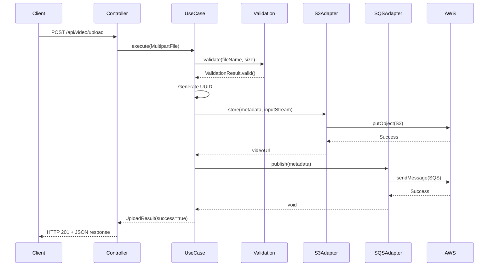
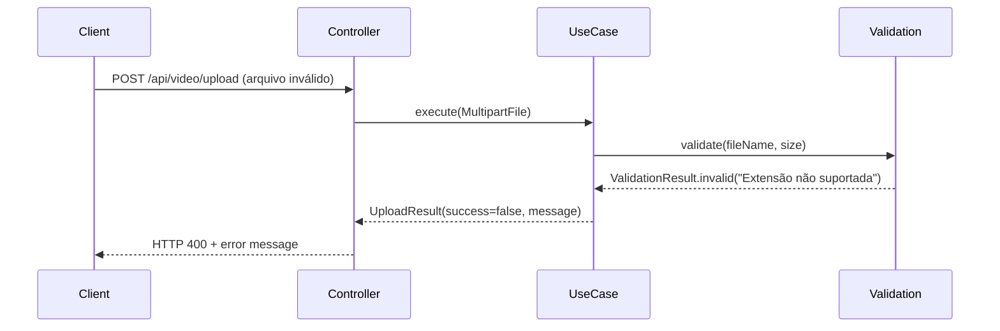
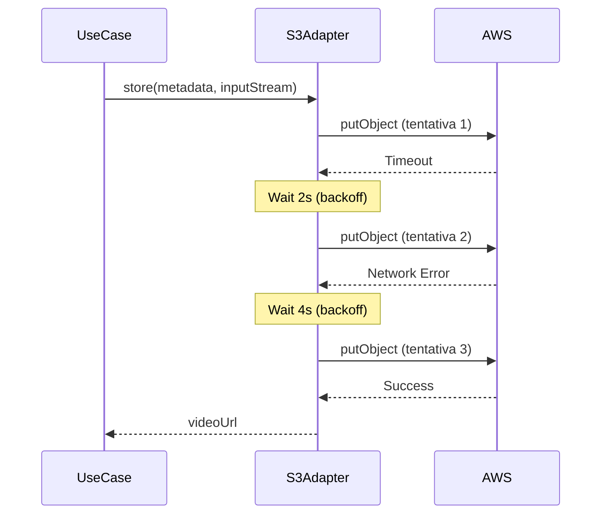
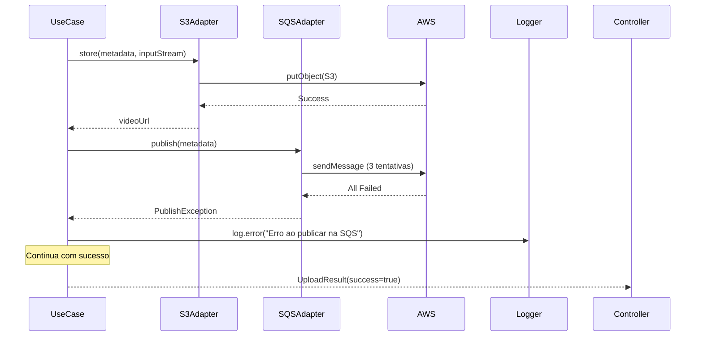

# Design Document: AWS S3 e SQS Integration

## Overview

Esta funcionalidade adiciona integração com Amazon S3 e Amazon SQS ao sistema Video Slicer, migrando o armazenamento de vídeos do sistema de arquivos local para a nuvem e implementando processamento assíncrono através de mensageria.

O design mantém a arquitetura hexagonal existente, adicionando novos adapters para AWS S3 e SQS como portas de saída (output ports). A solução utiliza o AWS SDK for Java v2 e segue os princípios de Clean Architecture, garantindo que a lógica de domínio permaneça independente de detalhes de infraestrutura.

### Principais Componentes

- **S3StorageService**: Port de saída para armazenamento de vídeos no S3
- **SQSPublisherService**: Port de saída para publicação de mensagens na fila SQS
- **AwsS3StorageAdapter**: Implementação do S3StorageService usando AWS SDK
- **AwsSqsPublisherAdapter**: Implementação do SQSPublisherService usando AWS SDK
- **UploadVideoUseCase**: Use case modificado para usar os novos serviços AWS
- **VideoMetadata**: Entidade de domínio representando metadados do vídeo
- **AwsConfiguration**: Configuração centralizada dos clientes AWS

### Fluxo de Dados

1. Cliente envia vídeo via HTTP POST para `/api/video/upload`
2. VideoController recebe o MultipartFile e delega para UploadVideoUseCase
3. UploadVideoUseCase valida o arquivo (tamanho, extensão, conteúdo)
4. UploadVideoUseCase gera UUID para o vídeo
5. UploadVideoUseCase chama S3StorageService para armazenar no S3
6. S3StorageService retorna URL do vídeo armazenado
7. UploadVideoUseCase chama SQSPublisherService para publicar mensagem
8. VideoController retorna resposta com videoId e videoUrl ao cliente


## Architecture

### Arquitetura Hexagonal

O design segue a arquitetura hexagonal existente do projeto, organizando os componentes em camadas:

```
┌─────────────────────────────────────────────────────────────┐
│                    Adapters (Input)                         │
│  ┌──────────────────────────────────────────────────────┐   │
│  │         VideoController (REST API)                   │   │
│  └──────────────────────────────────────────────────────┘   │
└─────────────────────────────────────────────────────────────┘
                            │
                            ▼
┌─────────────────────────────────────────────────────────────┐
│                  Application Layer                          │
│  ┌──────────────────────────────────────────────────────┐   │
│  │         UploadVideoUseCase (Interface)               │   │
│  │         UploadVideoUseCaseImpl                       │   │
│  └──────────────────────────────────────────────────────┘   │
└─────────────────────────────────────────────────────────────┘
                            │
                            ▼
┌─────────────────────────────────────────────────────────────┐
│                    Domain Layer                             │
│  ┌──────────────────────────────────────────────────────┐   │
│  │  VideoMetadata, VideoId, VideoValidation            │   │
│  └──────────────────────────────────────────────────────┘   │
└─────────────────────────────────────────────────────────────┘
                            │
                            ▼
┌─────────────────────────────────────────────────────────────┐
│              Application Ports (Output)                     │
│  ┌──────────────────────────────────────────────────────┐   │
│  │  S3StorageService (Interface)                        │   │
│  │  SQSPublisherService (Interface)                     │   │
│  └──────────────────────────────────────────────────────┘   │
└─────────────────────────────────────────────────────────────┘
                            │
                            ▼
┌─────────────────────────────────────────────────────────────┐
│                Adapters (Output)                            │
│  ┌──────────────────────────────────────────────────────┐   │
│  │  AwsS3StorageAdapter                                 │   │
│  │  AwsSqsPublisherAdapter                              │   │
│  └──────────────────────────────────────────────────────┘   │
└─────────────────────────────────────────────────────────────┘
                            │
                            ▼
                    ┌───────────────┐
                    │   AWS Cloud   │
                    │  S3  │  SQS   │
                    └───────────────┘
```

### Princípios de Design

1. **Dependency Inversion**: Use cases dependem de interfaces (ports), não de implementações concretas
2. **Single Responsibility**: Cada adapter tem uma responsabilidade única (S3 ou SQS)
3. **Open/Closed**: Fácil adicionar novos adapters (ex: Azure Blob Storage) sem modificar use cases
4. **Interface Segregation**: Interfaces específicas e focadas (S3StorageService, SQSPublisherService)
5. **Separation of Concerns**: Lógica de negócio isolada de detalhes de infraestrutura AWS


## Components and Interfaces

### Domain Layer

#### VideoMetadata

Entidade de domínio que encapsula os metadados de um vídeo.

```java
package com.videoslicer.video_slicer.domain.video;

import java.time.Instant;
import java.util.UUID;

public class VideoMetadata {
    private final UUID videoId;
    private final String fileName;
    private final String extension;
    private final long sizeInBytes;
    private final Instant uploadTimestamp;
    
    public VideoMetadata(UUID videoId, String fileName, String extension, 
                        long sizeInBytes, Instant uploadTimestamp) {
        this.videoId = videoId;
        this.fileName = fileName;
        this.extension = extension;
        this.sizeInBytes = sizeInBytes;
        this.uploadTimestamp = uploadTimestamp;
    }
    
    // Getters
    public UUID getVideoId() { return videoId; }
    public String getFileName() { return fileName; }
    public String getExtension() { return extension; }
    public long getSizeInBytes() { return sizeInBytes; }
    public Instant getUploadTimestamp() { return uploadTimestamp; }
    
    public String getS3Key() {
        return videoId.toString() + "." + extension;
    }
}
```

#### VideoValidation

Value object para validação de arquivos de vídeo.

```java
package com.videoslicer.video_slicer.domain.video;

import java.util.Set;

public class VideoValidation {
    private static final Set<String> SUPPORTED_EXTENSIONS = 
        Set.of("mp4", "avi", "mov", "mkv", "webm");
    private static final long MAX_FILE_SIZE = 500 * 1024 * 1024; // 500MB
    
    public static ValidationResult validate(String fileName, long fileSize) {
        if (fileName == null || fileName.isBlank()) {
            return ValidationResult.invalid("Nome do arquivo não pode ser vazio");
        }
        
        String extension = extractExtension(fileName);
        if (!SUPPORTED_EXTENSIONS.contains(extension.toLowerCase())) {
            return ValidationResult.invalid(
                "Extensão não suportada. Formatos aceitos: " + SUPPORTED_EXTENSIONS
            );
        }
        
        if (fileSize <= 0) {
            return ValidationResult.invalid("Arquivo vazio");
        }
        
        if (fileSize > MAX_FILE_SIZE) {
            return ValidationResult.invalid(
                "Arquivo excede o tamanho máximo de 500MB"
            );
        }
        
        return ValidationResult.valid();
    }
    
    private static String extractExtension(String fileName) {
        int lastDot = fileName.lastIndexOf('.');
        if (lastDot < 0) return "";
        return fileName.substring(lastDot + 1);
    }
    
    public static class ValidationResult {
        private final boolean valid;
        private final String errorMessage;
        
        private ValidationResult(boolean valid, String errorMessage) {
            this.valid = valid;
            this.errorMessage = errorMessage;
        }
        
        public static ValidationResult valid() {
            return new ValidationResult(true, null);
        }
        
        public static ValidationResult invalid(String message) {
            return new ValidationResult(false, message);
        }
        
        public boolean isValid() { return valid; }
        public String getErrorMessage() { return errorMessage; }
    }
}
```


### Application Layer - Ports (Interfaces)

#### S3StorageService

Interface que define o contrato para armazenamento de vídeos.

```java
package com.videoslicer.video_slicer.application.ports;

import com.videoslicer.video_slicer.domain.video.VideoMetadata;
import java.io.InputStream;

public interface S3StorageService {
    
    /**
     * Armazena um vídeo no S3
     * @param videoMetadata Metadados do vídeo
     * @param inputStream Stream do arquivo de vídeo
     * @return URL completa do vídeo armazenado no S3
     * @throws StorageException se houver erro no armazenamento
     */
    String store(VideoMetadata videoMetadata, InputStream inputStream) 
        throws StorageException;
    
    /**
     * Recupera um vídeo do S3 como InputStream
     * @param videoId ID do vídeo
     * @param extension Extensão do arquivo
     * @return InputStream do vídeo
     * @throws StorageException se o vídeo não for encontrado ou houver erro
     */
    InputStream retrieve(String videoId, String extension) 
        throws StorageException;
    
    class StorageException extends Exception {
        public StorageException(String message, Throwable cause) {
            super(message, cause);
        }
    }
}
```

#### SQSPublisherService

Interface que define o contrato para publicação de mensagens.

```java
package com.videoslicer.video_slicer.application.ports;

import com.videoslicer.video_slicer.domain.video.VideoMetadata;

public interface SQSPublisherService {
    
    /**
     * Publica mensagem com metadados do vídeo na fila SQS
     * @param videoMetadata Metadados do vídeo a serem publicados
     * @throws PublishException se houver erro na publicação
     */
    void publish(VideoMetadata videoMetadata) throws PublishException;
    
    class PublishException extends Exception {
        public PublishException(String message, Throwable cause) {
            super(message, cause);
        }
    }
}
```


### Application Layer - Use Cases

#### UploadVideoUseCase (Modificado)

```java
package com.videoslicer.video_slicer.application.usecases;

import org.springframework.web.multipart.MultipartFile;
import java.util.UUID;

public interface UploadVideoUseCase {
    UploadResult execute(MultipartFile file);

    class UploadResult {
        public final boolean success;
        public final String fileName;  // Mantido para retrocompatibilidade
        public final UUID videoId;     // Novo campo
        public final String videoUrl;  // Novo campo
        public final String message;

        public UploadResult(boolean success, String fileName, UUID videoId, 
                          String videoUrl, String message) {
            this.success = success;
            this.fileName = fileName;
            this.videoId = videoId;
            this.videoUrl = videoUrl;
            this.message = message;
        }
        
        // Construtor para casos de erro (retrocompatibilidade)
        public UploadResult(boolean success, String message) {
            this(success, null, null, null, message);
        }
    }
}
```

#### UploadVideoUseCaseImpl (Modificado)

```java
package com.videoslicer.video_slicer.application.usecases.impl;

import com.videoslicer.video_slicer.application.ports.S3StorageService;
import com.videoslicer.video_slicer.application.ports.SQSPublisherService;
import com.videoslicer.video_slicer.application.usecases.UploadVideoUseCase;
import com.videoslicer.video_slicer.domain.video.VideoMetadata;
import com.videoslicer.video_slicer.domain.video.VideoValidation;
import org.slf4j.Logger;
import org.slf4j.LoggerFactory;
import org.springframework.stereotype.Service;
import org.springframework.web.multipart.MultipartFile;

import java.time.Instant;
import java.util.UUID;

@Service
public class UploadVideoUseCaseImpl implements UploadVideoUseCase {
    
    private static final Logger logger = LoggerFactory.getLogger(UploadVideoUseCaseImpl.class);
    
    private final S3StorageService s3StorageService;
    private final SQSPublisherService sqsPublisherService;
    
    public UploadVideoUseCaseImpl(S3StorageService s3StorageService,
                                 SQSPublisherService sqsPublisherService) {
        this.s3StorageService = s3StorageService;
        this.sqsPublisherService = sqsPublisherService;
    }
    
    @Override
    public UploadResult execute(MultipartFile file) {
        try {
            // Validação
            var validation = VideoValidation.validate(
                file.getOriginalFilename(), 
                file.getSize()
            );
            
            if (!validation.isValid()) {
                return new UploadResult(false, validation.getErrorMessage());
            }
            
            // Geração de metadados
            UUID videoId = UUID.randomUUID();
            String extension = extractExtension(file.getOriginalFilename());
            VideoMetadata metadata = new VideoMetadata(
                videoId,
                file.getOriginalFilename(),
                extension,
                file.getSize(),
                Instant.now()
            );
            
            // Armazenamento no S3
            String videoUrl = s3StorageService.store(metadata, file.getInputStream());
            logger.info("Vídeo armazenado no S3: {}", videoUrl);
            
            // Publicação na fila SQS
            try {
                sqsPublisherService.publish(metadata);
                logger.info("Mensagem publicada na SQS para vídeo: {}", videoId);
            } catch (Exception e) {
                // Falha na publicação não impede sucesso do upload
                logger.error("Erro ao publicar mensagem na SQS para vídeo: {}", videoId, e);
            }
            
            String fileName = metadata.getS3Key();
            return new UploadResult(true, fileName, videoId, videoUrl, 
                                  "Vídeo carregado com sucesso!");
            
        } catch (Exception e) {
            logger.error("Erro ao fazer upload do vídeo", e);
            return new UploadResult(false, "Erro ao carregar o arquivo: " + e.getMessage());
        }
    }
    
    private String extractExtension(String fileName) {
        if (fileName == null) return "";
        int i = fileName.lastIndexOf('.');
        if (i < 0) return "";
        return fileName.substring(i + 1);
    }
}
```


### Adapters Layer - Output Adapters

#### AwsS3StorageAdapter

Implementação do S3StorageService usando AWS SDK v2.

```java
package com.videoslicer.video_slicer.adapters.aws;

import com.videoslicer.video_slicer.application.ports.S3StorageService;
import com.videoslicer.video_slicer.domain.video.VideoMetadata;
import org.slf4j.Logger;
import org.slf4j.LoggerFactory;
import org.springframework.beans.factory.annotation.Value;
import org.springframework.stereotype.Component;
import software.amazon.awssdk.core.sync.RequestBody;
import software.amazon.awssdk.services.s3.S3Client;
import software.amazon.awssdk.services.s3.model.GetObjectRequest;
import software.amazon.awssdk.services.s3.model.PutObjectRequest;

import java.io.InputStream;

@Component
public class AwsS3StorageAdapter implements S3StorageService {
    
    private static final Logger logger = LoggerFactory.getLogger(AwsS3StorageAdapter.class);
    private static final int MAX_RETRIES = 3;
    
    private final S3Client s3Client;
    private final String bucketName;
    private final String folderPrefix;
    
    public AwsS3StorageAdapter(S3Client s3Client,
                              @Value("${aws.s3.bucket-name}") String bucketName,
                              @Value("${aws.s3.folder-prefix:videos/}") String folderPrefix) {
        this.s3Client = s3Client;
        this.bucketName = bucketName;
        this.folderPrefix = folderPrefix;
    }
    
    @Override
    public String store(VideoMetadata videoMetadata, InputStream inputStream) 
            throws StorageException {
        String key = folderPrefix + videoMetadata.getS3Key();
        
        Exception lastException = null;
        for (int attempt = 1; attempt <= MAX_RETRIES; attempt++) {
            try {
                PutObjectRequest putRequest = PutObjectRequest.builder()
                    .bucket(bucketName)
                    .key(key)
                    .contentType(getContentType(videoMetadata.getExtension()))
                    .contentLength(videoMetadata.getSizeInBytes())
                    .build();
                
                s3Client.putObject(putRequest, RequestBody.fromInputStream(
                    inputStream, videoMetadata.getSizeInBytes()));
                
                String url = String.format("https://%s.s3.amazonaws.com/%s", 
                                         bucketName, key);
                logger.info("Vídeo armazenado com sucesso no S3: {}", url);
                return url;
                
            } catch (Exception e) {
                lastException = e;
                logger.warn("Tentativa {} de {} falhou ao armazenar no S3", 
                          attempt, MAX_RETRIES, e);
                
                if (attempt < MAX_RETRIES) {
                    try {
                        Thread.sleep((long) Math.pow(2, attempt) * 1000); // Backoff exponencial
                    } catch (InterruptedException ie) {
                        Thread.currentThread().interrupt();
                        throw new StorageException("Upload interrompido", ie);
                    }
                }
            }
        }
        
        throw new StorageException(
            "Falha ao armazenar vídeo no S3 após " + MAX_RETRIES + " tentativas", 
            lastException
        );
    }
    
    @Override
    public InputStream retrieve(String videoId, String extension) 
            throws StorageException {
        String key = folderPrefix + videoId + "." + extension;
        
        try {
            GetObjectRequest getRequest = GetObjectRequest.builder()
                .bucket(bucketName)
                .key(key)
                .build();
            
            return s3Client.getObject(getRequest);
            
        } catch (Exception e) {
            throw new StorageException("Erro ao recuperar vídeo do S3: " + key, e);
        }
    }
    
    private String getContentType(String extension) {
        return switch (extension.toLowerCase()) {
            case "mp4" -> "video/mp4";
            case "avi" -> "video/x-msvideo";
            case "mov" -> "video/quicktime";
            case "mkv" -> "video/x-matroska";
            case "webm" -> "video/webm";
            default -> "application/octet-stream";
        };
    }
}
```


#### AwsSqsPublisherAdapter

Implementação do SQSPublisherService usando AWS SDK v2.

```java
package com.videoslicer.video_slicer.adapters.aws;

import com.fasterxml.jackson.databind.ObjectMapper;
import com.videoslicer.video_slicer.application.ports.SQSPublisherService;
import com.videoslicer.video_slicer.domain.video.VideoMetadata;
import org.slf4j.Logger;
import org.slf4j.LoggerFactory;
import org.springframework.beans.factory.annotation.Value;
import org.springframework.stereotype.Component;
import software.amazon.awssdk.services.sqs.SqsClient;
import software.amazon.awssdk.services.sqs.model.SendMessageRequest;

import java.util.HashMap;
import java.util.Map;

@Component
public class AwsSqsPublisherAdapter implements SQSPublisherService {
    
    private static final Logger logger = LoggerFactory.getLogger(AwsSqsPublisherAdapter.class);
    private static final int MAX_RETRIES = 3;
    
    private final SqsClient sqsClient;
    private final String queueUrl;
    private final ObjectMapper objectMapper;
    
    public AwsSqsPublisherAdapter(SqsClient sqsClient,
                                 @Value("${aws.sqs.queue-url}") String queueUrl,
                                 ObjectMapper objectMapper) {
        this.sqsClient = sqsClient;
        this.queueUrl = queueUrl;
        this.objectMapper = objectMapper;
    }
    
    @Override
    public void publish(VideoMetadata videoMetadata) throws PublishException {
        String messageBody = createMessageBody(videoMetadata);
        
        Exception lastException = null;
        for (int attempt = 1; attempt <= MAX_RETRIES; attempt++) {
            try {
                SendMessageRequest sendRequest = SendMessageRequest.builder()
                    .queueUrl(queueUrl)
                    .messageBody(messageBody)
                    .build();
                
                sqsClient.sendMessage(sendRequest);
                logger.info("Mensagem publicada na SQS para vídeo: {}", 
                          videoMetadata.getVideoId());
                return;
                
            } catch (Exception e) {
                lastException = e;
                logger.warn("Tentativa {} de {} falhou ao publicar na SQS", 
                          attempt, MAX_RETRIES, e);
                
                if (attempt < MAX_RETRIES) {
                    try {
                        Thread.sleep((long) Math.pow(2, attempt) * 1000); // Backoff exponencial
                    } catch (InterruptedException ie) {
                        Thread.currentThread().interrupt();
                        throw new PublishException("Publicação interrompida", ie);
                    }
                }
            }
        }
        
        throw new PublishException(
            "Falha ao publicar mensagem na SQS após " + MAX_RETRIES + " tentativas", 
            lastException
        );
    }
    
    private String createMessageBody(VideoMetadata metadata) throws PublishException {
        try {
            Map<String, Object> message = new HashMap<>();
            message.put("videoId", metadata.getVideoId().toString());
            message.put("fileName", metadata.getFileName());
            message.put("extension", metadata.getExtension());
            message.put("sizeInBytes", metadata.getSizeInBytes());
            message.put("uploadTimestamp", metadata.getUploadTimestamp().toString());
            
            return objectMapper.writeValueAsString(message);
        } catch (Exception e) {
            throw new PublishException("Erro ao criar corpo da mensagem JSON", e);
        }
    }
}
```


### Configuration

#### AwsConfiguration

Configuração centralizada dos clientes AWS.

```java
package com.videoslicer.video_slicer.config;

import com.fasterxml.jackson.databind.ObjectMapper;
import org.springframework.beans.factory.annotation.Value;
import org.springframework.context.annotation.Bean;
import org.springframework.context.annotation.Configuration;
import software.amazon.awssdk.auth.credentials.AwsBasicCredentials;
import software.amazon.awssdk.auth.credentials.AwsCredentialsProvider;
import software.amazon.awssdk.auth.credentials.DefaultCredentialsProvider;
import software.amazon.awssdk.auth.credentials.StaticCredentialsProvider;
import software.amazon.awssdk.regions.Region;
import software.amazon.awssdk.services.s3.S3Client;
import software.amazon.awssdk.services.sqs.SqsClient;

@Configuration
public class AwsConfiguration {
    
    @Value("${aws.region}")
    private String region;
    
    @Value("${aws.access-key-id:#{null}}")
    private String accessKeyId;
    
    @Value("${aws.secret-access-key:#{null}}")
    private String secretAccessKey;
    
    @Bean
    public AwsCredentialsProvider awsCredentialsProvider() {
        // Prioriza credenciais explícitas, senão usa DefaultCredentialsProvider
        // que busca em variáveis de ambiente, arquivo de credenciais, etc.
        if (accessKeyId != null && secretAccessKey != null) {
            return StaticCredentialsProvider.create(
                AwsBasicCredentials.create(accessKeyId, secretAccessKey)
            );
        }
        return DefaultCredentialsProvider.create();
    }
    
    @Bean
    public S3Client s3Client(AwsCredentialsProvider credentialsProvider) {
        return S3Client.builder()
            .region(Region.of(region))
            .credentialsProvider(credentialsProvider)
            .build();
    }
    
    @Bean
    public SqsClient sqsClient(AwsCredentialsProvider credentialsProvider) {
        return SqsClient.builder()
            .region(Region.of(region))
            .credentialsProvider(credentialsProvider)
            .build();
    }
    
    @Bean
    public ObjectMapper objectMapper() {
        return new ObjectMapper();
    }
}
```

#### AwsConfigurationValidator

Validador de configurações AWS na inicialização.

```java
package com.videoslicer.video_slicer.config;

import org.slf4j.Logger;
import org.slf4j.LoggerFactory;
import org.springframework.beans.factory.annotation.Value;
import org.springframework.boot.context.event.ApplicationReadyEvent;
import org.springframework.context.event.EventListener;
import org.springframework.stereotype.Component;

@Component
public class AwsConfigurationValidator {
    
    private static final Logger logger = LoggerFactory.getLogger(AwsConfigurationValidator.class);
    
    @Value("${aws.region:#{null}}")
    private String region;
    
    @Value("${aws.s3.bucket-name:#{null}}")
    private String bucketName;
    
    @Value("${aws.sqs.queue-url:#{null}}")
    private String queueUrl;
    
    @EventListener(ApplicationReadyEvent.class)
    public void validateConfiguration() {
        StringBuilder errors = new StringBuilder();
        
        if (region == null || region.isBlank()) {
            errors.append("- aws.region não configurado\n");
        }
        
        if (bucketName == null || bucketName.isBlank()) {
            errors.append("- aws.s3.bucket-name não configurado\n");
        }
        
        if (queueUrl == null || queueUrl.isBlank()) {
            errors.append("- aws.sqs.queue-url não configurado\n");
        }
        
        if (errors.length() > 0) {
            String errorMessage = "Configurações AWS obrigatórias ausentes:\n" + errors;
            logger.error(errorMessage);
            throw new IllegalStateException(errorMessage);
        }
        
        logger.info("Configurações AWS validadas com sucesso");
        logger.info("Região: {}", region);
        logger.info("Bucket S3: {}", bucketName);
        logger.info("Fila SQS: {}", queueUrl);
    }
}
```


### Adapters Layer - Input Adapters

#### VideoController (Modificado)

```java
package com.videoslicer.video_slicer.adapters.controllers;

import org.springframework.http.HttpStatus;
import org.springframework.http.ResponseEntity;
import org.springframework.validation.annotation.Validated;
import org.springframework.web.bind.annotation.*;
import org.springframework.web.multipart.MultipartFile;

import com.videoslicer.video_slicer.application.usecases.UploadVideoUseCase;
import com.videoslicer.video_slicer.application.usecases.SliceVideoUseCase;

import java.util.HashMap;
import java.util.Map;

@Validated
@RestController
@RequestMapping("/api/video")
public class VideoController {
    private final UploadVideoUseCase uploadUseCase;
    private final SliceVideoUseCase sliceUseCase;

    public VideoController(UploadVideoUseCase uploadUseCase, SliceVideoUseCase sliceUseCase) {
        this.uploadUseCase = uploadUseCase;
        this.sliceUseCase = sliceUseCase;
    }

    @PostMapping("/upload")
    @ResponseStatus(HttpStatus.CREATED)
    public ResponseEntity<?> upload(@RequestParam MultipartFile file) {
        var result = uploadUseCase.execute(file);
        
        if (result.success) {
            Map<String, Object> content = new HashMap<>();
            content.put("fileName", result.fileName);  // Retrocompatibilidade
            content.put("videoId", result.videoId.toString());
            content.put("videoUrl", result.videoUrl);
            
            return ResponseEntity.status(HttpStatus.CREATED).body(
                Map.of("message", result.message, "content", content)
            );
        }
        
        // Determina código de erro apropriado
        HttpStatus status = result.message.contains("não suportada") || 
                           result.message.contains("vazio") ||
                           result.message.contains("excede") 
                           ? HttpStatus.BAD_REQUEST 
                           : HttpStatus.INTERNAL_SERVER_ERROR;
        
        return ResponseEntity.status(status).body(
            Map.of("message", result.message)
        );
    }

    @GetMapping("/slice")
    @ResponseStatus(HttpStatus.OK)
    public ResponseEntity<?> slice(@RequestParam String fileName, 
                                  @RequestParam int timeInterval) {
        var result = sliceUseCase.execute(fileName, timeInterval);
        if (result.success) {
            return ResponseEntity.ok(
                Map.of("message", result.message, 
                      "content", Map.of("outputPrefix", result.outputPrefix))
            );
        }
        return ResponseEntity.status(HttpStatus.NOT_FOUND).body(
            Map.of("message", result.message)
        );
    }
}
```


## Data Models

### Estrutura de Mensagem SQS

A mensagem publicada na fila SQS segue o formato JSON:

```json
{
  "videoId": "550e8400-e29b-41d4-a716-446655440000",
  "fileName": "meu-video.mp4",
  "extension": "mp4",
  "sizeInBytes": 52428800,
  "uploadTimestamp": "2024-01-15T10:30:00Z"
}
```

### Estrutura de Resposta da API

#### Resposta de Upload Bem-Sucedido (HTTP 201)

```json
{
  "message": "Vídeo carregado com sucesso!",
  "content": {
    "fileName": "550e8400-e29b-41d4-a716-446655440000.mp4",
    "videoId": "550e8400-e29b-41d4-a716-446655440000",
    "videoUrl": "https://my-bucket.s3.amazonaws.com/videos/550e8400-e29b-41d4-a716-446655440000.mp4"
  }
}
```

#### Resposta de Erro de Validação (HTTP 400)

```json
{
  "message": "Extensão não suportada. Formatos aceitos: [mp4, avi, mov, mkv, webm]"
}
```

#### Resposta de Erro de Servidor (HTTP 500)

```json
{
  "message": "Erro ao carregar o arquivo: Connection timeout"
}
```

### Estrutura de Armazenamento S3

Os vídeos são organizados no bucket S3 seguindo a estrutura:

```
my-bucket/
└── videos/
    ├── 550e8400-e29b-41d4-a716-446655440000.mp4
    ├── 661f9511-f3ac-52e5-b827-557766551111.avi
    └── 772fa622-g4bd-63f6-c938-668877662222.mov
```

O prefixo `videos/` é configurável através da propriedade `aws.s3.folder-prefix`.

### Configurações no application.properties

```properties
# Configurações AWS
aws.region=us-east-1
aws.access-key-id=${AWS_ACCESS_KEY_ID:}
aws.secret-access-key=${AWS_SECRET_ACCESS_KEY:}

# Configurações S3
aws.s3.bucket-name=my-video-bucket
aws.s3.folder-prefix=videos/

# Configurações SQS
aws.sqs.queue-url=https://sqs.us-east-1.amazonaws.com/123456789012/video-processing-queue

# Configurações de upload (existentes)
spring.servlet.multipart.max-file-size=500MB
spring.servlet.multipart.max-request-size=500MB
```

### Dependências Maven (pom.xml)

```xml
<!-- AWS SDK v2 -->
<dependency>
    <groupId>software.amazon.awssdk</groupId>
    <artifactId>s3</artifactId>
    <version>2.20.26</version>
</dependency>

<dependency>
    <groupId>software.amazon.awssdk</groupId>
    <artifactId>sqs</artifactId>
    <version>2.20.26</version>
</dependency>

<!-- Jackson para serialização JSON (já incluído no Spring Boot) -->
<dependency>
    <groupId>com.fasterxml.jackson.core</groupId>
    <artifactId>jackson-databind</artifactId>
</dependency>
```


## Correctness Properties

*A property is a characteristic or behavior that should hold true across all valid executions of a system-essentially, a formal statement about what the system should do. Properties serve as the bridge between human-readable specifications and machine-verifiable correctness guarantees.*

### Property Reflection

Após análise dos critérios de aceitação, identifiquei as seguintes redundâncias:

- **Properties 1.2 e 1.3** (preservar extensão e usar UUID) podem ser combinadas em uma única property sobre formato de chave S3
- **Properties 2.2 e 7.2** (retornar videoId na resposta) são redundantes - uma única property cobre ambos
- **Properties 7.2, 7.3, 7.4** (campos na resposta) podem ser combinadas em uma property sobre estrutura completa da resposta
- **Properties 3.2 e 3.3** (campos na mensagem SQS) podem ser combinadas em uma property sobre estrutura completa da mensagem
- **Properties 8.1, 8.2, 8.3** (validações) podem ser testadas através de uma property geral de validação
- **Properties 9.3 e 9.4** (retrocompatibilidade do campo fileName) são redundantes

Após eliminação de redundâncias, as properties finais são:


### Property 1: S3 Key Format

*For any* valid video uploaded, the S3 key SHALL follow the format `{prefix}/{uuid}.{extension}` where uuid is a valid UUID v4 and extension matches the original file extension.

**Validates: Requirements 1.2, 1.3, 1.5, 2.1**

### Property 2: Video ID Consistency

*For any* successful upload, the videoId returned in the response SHALL match the base name of the file stored in S3 (without extension).

**Validates: Requirements 2.4**

### Property 3: SQS Message Structure

*For any* video successfully uploaded to S3, the message published to SQS SHALL be valid JSON containing fields: videoId (UUID string), fileName (string), extension (string), sizeInBytes (positive long), and uploadTimestamp (ISO-8601 string).

**Validates: Requirements 3.2, 3.3, 3.5**

### Property 4: Upload Response Structure

*For any* successful upload (HTTP 201), the response SHALL be valid JSON containing a "message" field (non-empty string) and a "content" object with fields: "videoId" (UUID string), "videoUrl" (valid URL string), and "fileName" (non-empty string).

**Validates: Requirements 7.1, 7.2, 7.3, 7.4, 9.3, 9.4**

### Property 5: Validation Rejection

*For any* file that is empty (size = 0), has unsupported extension (not in [mp4, avi, mov, mkv, webm]), or exceeds 500MB, the upload SHALL be rejected with HTTP 400 and a descriptive error message.

**Validates: Requirements 8.1, 8.2, 8.3, 8.4**

### Property 6: S3 Retry Mechanism

*For any* S3 operation that fails with a retryable error (timeout, network error), exactly 3 attempts SHALL be made with exponential backoff before throwing StorageException.

**Validates: Requirements 6.1**

### Property 7: SQS Retry Mechanism

*For any* SQS operation that fails with a retryable error (timeout, network error), exactly 3 attempts SHALL be made with exponential backoff before throwing PublishException.

**Validates: Requirements 6.2**

### Property 8: Audit Logging

*For any* failed AWS operation (S3 or SQS), at least one log entry SHALL be generated containing the error details.

**Validates: Requirements 6.5**

### Property 9: Extension Preservation Round Trip

*For any* video with a supported extension uploaded to S3, retrieving the video SHALL return a stream that can be identified by the same extension.

**Validates: Requirements 1.2**


## Error Handling

### Estratégia de Tratamento de Erros

O sistema implementa uma estratégia de tratamento de erros em camadas, onde cada camada tem responsabilidades específicas:

#### 1. Domain Layer - Validação

A camada de domínio é responsável por validar regras de negócio:

- **VideoValidation**: Valida formato, tamanho e extensão de arquivos
- Retorna `ValidationResult` com mensagens descritivas
- Não lança exceções, retorna objetos de resultado

#### 2. Application Layer - Orquestração

A camada de aplicação orquestra operações e trata exceções:

- **UploadVideoUseCaseImpl**: Captura exceções dos adapters
- Converte exceções técnicas em `UploadResult` com mensagens amigáveis
- Implementa política de "melhor esforço" para SQS (falha não impede sucesso do upload)
- Registra erros em log para auditoria

#### 3. Adapters Layer - Resiliência

Os adapters implementam mecanismos de resiliência:

- **AwsS3StorageAdapter**: Retry com backoff exponencial (3 tentativas)
- **AwsSqsPublisherAdapter**: Retry com backoff exponencial (3 tentativas)
- Lançam exceções específicas (`StorageException`, `PublishException`)
- Registram cada tentativa e falha em log

#### 4. Controller Layer - HTTP Status

O controller mapeia resultados para códigos HTTP apropriados:

- **HTTP 201**: Upload bem-sucedido
- **HTTP 400**: Erro de validação (arquivo inválido)
- **HTTP 500**: Erro de servidor (falha no S3)

### Cenários de Erro

#### Cenário 1: Arquivo Inválido

```
Cliente → Controller → UseCase → VideoValidation
                                      ↓
                                  ValidationResult.invalid()
                                      ↓
                      UploadResult(success=false, message="...")
                                      ↓
                      HTTP 400 Bad Request
```

#### Cenário 2: Falha no S3 (Temporária)

```
UseCase → S3Adapter → AWS S3 (tentativa 1) ❌
                   → AWS S3 (tentativa 2) ❌
                   → AWS S3 (tentativa 3) ✅
                   → Retorna URL
```

#### Cenário 3: Falha no S3 (Permanente)

```
UseCase → S3Adapter → AWS S3 (3 tentativas) ❌
                   → StorageException
                   → UseCase captura e retorna UploadResult(success=false)
                   → HTTP 500 Internal Server Error
```

#### Cenário 4: Falha no SQS (Não Crítica)

```
UseCase → S3Adapter → AWS S3 ✅
       → SQSAdapter → AWS SQS (3 tentativas) ❌
                   → PublishException
                   → UseCase captura, registra log, mas retorna success=true
                   → HTTP 201 Created (upload foi bem-sucedido)
```

### Mensagens de Erro

Todas as mensagens de erro são descritivas e orientadas ao usuário:

- **Validação**: "Extensão não suportada. Formatos aceitos: [mp4, avi, mov, mkv, webm]"
- **Arquivo vazio**: "Arquivo vazio"
- **Tamanho excedido**: "Arquivo excede o tamanho máximo de 500MB"
- **Erro S3**: "Erro ao carregar o arquivo: {detalhes técnicos}"
- **Configuração**: "Configurações AWS obrigatórias ausentes: - aws.region não configurado"


## Testing Strategy

### Abordagem Dual de Testes

O sistema será testado usando uma combinação de testes unitários e testes baseados em propriedades (property-based testing), garantindo cobertura abrangente:

- **Testes Unitários**: Verificam exemplos específicos, casos extremos e condições de erro
- **Testes de Propriedade**: Verificam propriedades universais através de múltiplas entradas geradas aleatoriamente

### Biblioteca de Property-Based Testing

Utilizaremos **jqwik** (https://jqwik.net/), a biblioteca líder de property-based testing para Java, que se integra perfeitamente com JUnit 5.

Dependência Maven:

```xml
<dependency>
    <groupId>net.jqwik</groupId>
    <artifactId>jqwik</artifactId>
    <version>1.7.4</version>
    <scope>test</scope>
</dependency>
```

### Configuração de Testes de Propriedade

Cada teste de propriedade será configurado para executar no mínimo 100 iterações:

```java
@Property(tries = 100)
@Label("Feature: aws-s3-sqs-integration, Property 1: S3 Key Format")
void s3KeyFormatProperty(@ForAll("validVideos") VideoMetadata video) {
    // Test implementation
}
```

### Estrutura de Testes

#### 1. Testes de Domínio

**VideoValidationTest** (Unit Tests)
- Exemplo: Arquivo MP4 válido de 100MB deve passar na validação
- Exemplo: Arquivo vazio deve falhar com mensagem específica
- Exemplo: Arquivo de 600MB deve falhar com mensagem de tamanho
- Edge case: Arquivo exatamente no limite de 500MB deve passar
- Edge case: Nome de arquivo sem extensão deve falhar

**VideoMetadataTest** (Property Tests)
- Property 1: Para qualquer VideoMetadata válido, getS3Key() deve retornar "{uuid}.{extension}"
- Property 2: Para qualquer VideoMetadata, sizeInBytes deve ser positivo

#### 2. Testes de Application Layer

**UploadVideoUseCaseImplTest** (Unit Tests + Property Tests)

Unit Tests:
- Exemplo: Upload de vídeo válido deve retornar success=true com videoId e videoUrl
- Exemplo: Upload com arquivo vazio deve retornar success=false com mensagem de erro
- Exemplo: Falha no S3 deve retornar success=false
- Exemplo: Falha no SQS não deve impedir sucesso do upload

Property Tests:
- **Property 2**: Video ID Consistency (100 iterações)
- **Property 4**: Upload Response Structure (100 iterações)
- **Property 5**: Validation Rejection (100 iterações)

#### 3. Testes de Adapters

**AwsS3StorageAdapterTest** (Unit Tests + Property Tests)

Unit Tests (com mocks do S3Client):
- Exemplo: Upload bem-sucedido deve retornar URL no formato correto
- Exemplo: Falha no S3 após 3 tentativas deve lançar StorageException
- Exemplo: Sucesso na 2ª tentativa deve retornar URL
- Exemplo: Retrieve de vídeo existente deve retornar InputStream

Property Tests:
- **Property 1**: S3 Key Format (100 iterações)
- **Property 6**: S3 Retry Mechanism (100 iterações)
- **Property 9**: Extension Preservation Round Trip (100 iterações)

**AwsSqsPublisherAdapterTest** (Unit Tests + Property Tests)

Unit Tests (com mocks do SqsClient):
- Exemplo: Publicação bem-sucedida não deve lançar exceção
- Exemplo: Falha após 3 tentativas deve lançar PublishException
- Exemplo: Mensagem deve ser JSON válido

Property Tests:
- **Property 3**: SQS Message Structure (100 iterações)
- **Property 7**: SQS Retry Mechanism (100 iterações)

#### 4. Testes de Integração

**VideoControllerIntegrationTest** (Integration Tests)

Usando Spring Boot Test com mocks dos serviços AWS:
- Exemplo: POST /api/video/upload com arquivo válido deve retornar 201
- Exemplo: POST com arquivo inválido deve retornar 400
- Exemplo: POST com falha no S3 deve retornar 500
- Exemplo: Resposta deve conter campos fileName, videoId e videoUrl

#### 5. Testes de Configuração

**AwsConfigurationValidatorTest** (Unit Tests)
- Exemplo: Inicialização sem aws.region deve lançar IllegalStateException
- Exemplo: Inicialização sem aws.s3.bucket-name deve lançar IllegalStateException
- Exemplo: Inicialização sem aws.sqs.queue-url deve lançar IllegalStateException
- Exemplo: Inicialização com todas as configurações deve ter sucesso
- Exemplo: Variáveis de ambiente devem ter precedência sobre application.properties

### Generators para Property-Based Testing

Para suportar os testes de propriedade, criaremos generators customizados:

```java
@Provide
Arbitrary<VideoMetadata> validVideos() {
    return Combinators.combine(
        Arbitraries.randomValue(r -> UUID.randomUUID()),
        Arbitraries.strings().alpha().ofMinLength(1).ofMaxLength(50),
        Arbitraries.of("mp4", "avi", "mov", "mkv", "webm"),
        Arbitraries.longs().between(1, 500 * 1024 * 1024),
        Arbitraries.defaultFor(Instant.class)
    ).as(VideoMetadata::new);
}

@Provide
Arbitrary<MultipartFile> invalidFiles() {
    return Arbitraries.oneOf(
        emptyFiles(),
        unsupportedExtensionFiles(),
        oversizedFiles()
    );
}
```

### Cobertura de Testes

Objetivo de cobertura:
- **Domain Layer**: 100% (lógica crítica de validação)
- **Application Layer**: 90%+ (use cases e orquestração)
- **Adapters Layer**: 85%+ (integração com AWS)
- **Controllers**: 80%+ (mapeamento HTTP)

### Testes de Regressão

Para garantir compatibilidade com o sistema existente:
- Manter todos os testes existentes do SliceVideoUseCase
- Adicionar testes de integração verificando que /api/video/slice continua funcional
- Verificar que a estrutura de resposta do upload mantém campo "fileName"


## Sequence Diagrams

### Upload Flow - Caso de Sucesso



### Upload Flow - Falha de Validação



### Upload Flow - Retry no S3



### Upload Flow - Falha no SQS (Não Crítica)



## Implementation Notes

### Ordem de Implementação Recomendada

1. **Fase 1: Domain Layer**
   - Criar VideoMetadata
   - Criar VideoValidation
   - Escrever testes unitários

2. **Fase 2: Application Ports**
   - Definir interfaces S3StorageService e SQSPublisherService
   - Definir exceções customizadas

3. **Fase 3: Configuration**
   - Implementar AwsConfiguration
   - Implementar AwsConfigurationValidator
   - Adicionar propriedades no application.properties
   - Atualizar pom.xml com dependências AWS SDK

4. **Fase 4: Adapters**
   - Implementar AwsS3StorageAdapter
   - Implementar AwsSqsPublisherAdapter
   - Escrever testes unitários com mocks

5. **Fase 5: Application Layer**
   - Modificar UploadVideoUseCase e UploadVideoUseCaseImpl
   - Escrever testes unitários e de propriedade

6. **Fase 6: Controller**
   - Modificar VideoController
   - Escrever testes de integração

7. **Fase 7: Property-Based Tests**
   - Implementar generators customizados
   - Implementar todos os testes de propriedade
   - Executar com 100+ iterações

### Considerações de Migração

Para migração gradual do sistema existente:

1. Manter código legado de armazenamento local temporariamente
2. Adicionar feature flag para alternar entre local e S3
3. Executar em paralelo durante período de transição
4. Migrar vídeos existentes para S3 em background
5. Remover código legado após validação completa

### Monitoramento e Observabilidade

Adicionar métricas para:
- Taxa de sucesso/falha de uploads S3
- Taxa de sucesso/falha de publicações SQS
- Latência de operações AWS
- Número de retries por operação
- Tamanho médio de arquivos uploadados

